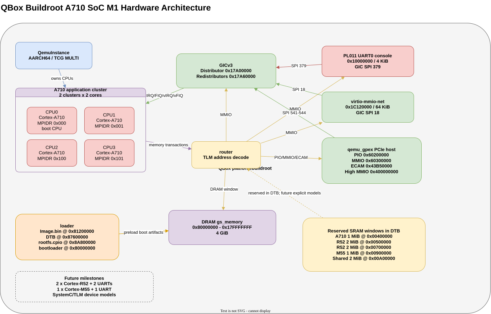
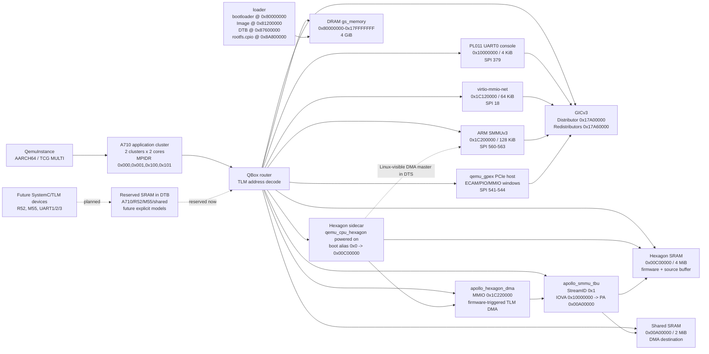

# Apollo SoC / apollo-qbox 하드웨어 아키텍처

> 기준일: 2026-04-26
> 기준 구현: `sources/qbox/platforms/buildroot/conf_aarch64.lua` + `configs/linux/apollo_soc.dts`

## 요약

현재 checkout에서 QBox가 플랫폼 구성을 자동으로 Graphviz/DOT/그림 파일로 export하는 사용자용 기능은 확인되지 않았습니다. 기존 draw.io/SVG는 1차 A710 Linux 부팅 구성을 보여주며, 최신 SMMUv3/Hexagon 확장은 아래 Mermaid 그림과 표에 반영했습니다.

- draw.io 원본: [`apollo-qbox-hw-architecture.drawio`](./apollo-qbox-hw-architecture.drawio)
- 문서용 SVG export: [`apollo-qbox-hw-architecture.svg`](./apollo-qbox-hw-architecture.svg)
- 1차 부팅 대상: 4 x Cortex-A710, GICv3, PL011 UART0, 4 GiB DRAM, initramfs 기반 Buildroot Linux
- 현재 확장 대상: Linux-visible ARM SMMUv3, powered-on Hexagon firmware smoke,
  SystemC `apollo_hexagon_dma` + `apollo_smmu_tbu` translated DMA path,
  Apollo Hexagon probe driver
- 이후 확장 대상: 2 x Cortex-R52, 1 x Cortex-M55, UART1/2/3,
  production reset/power ABI, native Hexagon DMA descriptor execution

## 하드웨어 구성 그림

> 참고: 위 SVG는 draw.io 원본에서 export한 1차 A710 부팅 구성 그림입니다. SMMUv3/Hexagon 최신 확장은 아래 Mermaid/메모리 맵이 기준이며, 다음 그림 갱신 시 draw.io 원본에도 반영해야 합니다.

## QBox 내장 그림 출력 기능 확인 결과

현재 소스 트리에서 `graphviz`, `.dot`, topology dump/export, hardware diagram exporter 관련 키워드를 검색했지만, 현재 플랫폼 구성을 곧바로 그림으로 뽑는 명령이나 API는 찾지 못했습니다. 확인된 관련 기능은 다음 수준입니다.

- `router`는 TLM 주소 decode 및 address-map 관리를 담당합니다.
- QEMU wrapper 쪽에는 `AddressSpace::update_topology()`처럼 QEMU memory topology 갱신과 관련된 내부 API가 있습니다.
- 문서에는 base/networking/platform 설명이 있으나, 현재 구성을 자동으로 DOT/PNG/SVG로 export하는 사용자용 도구는 확인되지 않았습니다.

따라서 이 문서는 현재 source-of-truth 파일에서 주소/연결 정보를 추출해 수동으로 정리한 아키텍처 문서입니다.

## Source of truth

| 항목 | 파일 |
| --- | --- |
| QBox 플랫폼 구성 | `sources/qbox/platforms/buildroot/conf_aarch64.lua` |
| Linux device tree | `configs/linux/apollo_soc.dts` |
| 편집 가능한 하드웨어 그림 | `doc/hardware/apollo-qbox-hw-architecture.drawio` |
| 커널 artifact load path | `sources/qbox/platforms/buildroot/fw/Artifacts/Image.bin` |
| DTB artifact load path | `sources/qbox/platforms/buildroot/fw/Artifacts/apollo_soc.dtb` |
| initramfs artifact load path | `sources/qbox/platforms/buildroot/fw/Artifacts/rootfs.cpio` |

## 현재 모델링 범위

### 구현됨: 1차 Linux 부팅 경로

| 구성 | 현재 상태 | 근거 |
| --- | --- | --- |
| Cortex-A710 CPU | 4 cores, 2 clusters x 2 cores | Lua `ARM_NUM_CPUS = 4`, DTS `cpu-map` |
| Cluster 0 | CPU0 MPIDR `0x000`, CPU1 MPIDR `0x001` | Lua `mp_affinity`, DTS `cpu@0`, `cpu@1` |
| Cluster 1 | CPU2 MPIDR `0x100`, CPU3 MPIDR `0x101` | Lua `mp_affinity`, DTS `cpu@100`, `cpu@101` |
| Boot CPU | CPU0만 reset 시 powered-on | Lua `start_powered_off` override |
| Interrupt controller | GICv3 | Lua `arm_gicv3`, DTS `arm,gic-v3` |
| Console UART | PL011 UART0 | Lua `Pl011`, DTS `serial@10000000` |
| DRAM | 4 GiB @ `0x80000000` | Lua `ram_0`, DTS `memory@80000000` |
| Root filesystem | `rootfs.cpio` initramfs | Lua loader + DTS `linux,initrd-*` |
| Network | `virtio_mmio_net` with user-mode host forwards | Lua `virtionet0_0` |
| PCIe host | `qemu_gpex` | Lua `gpex_0` |

### SMMUv3/Hexagon firmware-DMA 확장 및 예약 범위

| 구성 | 현재 상태 | 다음 작업 |
| --- | --- | --- |
| ARM SMMUv3 | QBox `arm_smmuv3` + DTS `arm,smmu-v3`로 Linux probe 완료 | SystemC/PCIe 외 DMA master stream wiring 확대 |
| Hexagon IP | `qemu_cpu_hexagon`이 firmware smoke를 실행하고 `apollo_hexagon_dma` MMIO를 program | reset/power control, mailbox/doorbell, production firmware ABI 설계 |
| Hexagon firmware DMA | `apollo_hexagon_dma.bin`이 IOVA `0x10201000` -> `0x10000000` copy를 요청하고 `apollo_smmu_tbu`가 PA `0x00C01000` -> `0x00A00000`으로 변환 | native Hexagon DMA descriptor 실행으로 확장 |
| Hexagon Linux probe | built-in `apollo-hexagon-test` driver가 IOMMU group, APSS coherent DMA, firmware DMA destination pattern 확인 | production driver ABI와 userspace interface 설계 |
| Cortex-R52 x 2 | 아직 CPU model 미연결 | Zephyr RTOS용 remote/core model 추가 |
| Cortex-M55 x 1 | 아직 CPU model 미연결 | Zephyr RTOS용 M-profile model 추가 |
| UART1/2/3 | 아직 미연결 | R52용 2개, M55용 1개 PL011 또는 대체 UART 추가 |
| SRAM 8 MiB | shared/Hexagon SRAM은 QBox `gs_memory`; 나머지는 DTS `reserved-memory` | R52/M55 SRAM도 명시 memory/device model로 승격 |
| SystemC 기반 device | `apollo_hexagon_dma.translated_dma -> apollo_smmu_tbu -> router`로 SMMU-translated TLM path 구성 | IRQ line, richer register ABI 추가 |

## 메모리 맵

### Low address / SRAM / MMIO

| 영역 | 시작 | 끝 | 크기 | 현재 모델 | 비고 |
| --- | ---: | ---: | ---: | --- | --- |
| Fallback low memory catch-all | `0x00000000` | `0x7FFFFFFFF` | 32 GiB | `fallback_0` (`gs_memory`) | priority 1, `dmi_allow=false`; 명시적 mapping 뒤의 broad fallback window입니다. DRAM/MMIO와 주소가 겹칠 수 있으므로 실제 device model 대체물이 아닙니다. |
| A710 SRAM reserved | `0x00400000` | `0x004FFFFF` | 1 MiB | DTS `reserved-memory` | A710용 예약 SRAM |
| R52 SRAM0 reserved | `0x00500000` | `0x006FFFFF` | 2 MiB | DTS `reserved-memory` | R52 core 0용 예정 |
| R52 SRAM1 reserved | `0x00700000` | `0x008FFFFF` | 2 MiB | DTS `reserved-memory` | R52 core 1용 예정 |
| M55 SRAM reserved | `0x00900000` | `0x009FFFFF` | 1 MiB | DTS `reserved-memory` | M55용 예정 |
| Shared SRAM | `0x00A00000` | `0x00BFFFFF` | 2 MiB | QBox `gs_memory` + DTS `reserved-memory` | Hexagon firmware DMA destination; Linux driver가 pattern 검증 |
| Hexagon SRAM | `0x00C00000` | `0x00FFFFFF` | 4 MiB | QBox `gs_memory` + DTS `reserved-memory` | firmware load/source buffer; Hexagon local boot alias `0x00000000` |
| Hexagon DMA IOVA window | `0x10000000` | `0x105FFFFF` | 6 MiB | QBox `apollo_smmu_tbu` + DTS `apollo,dma-iova-base/window-size` | StreamID `0x1`; IOVA `0x10000000` maps to PA `0x00A00000` |
| PL011 UART0 | `0x10000000` | `0x10000FFF` | 4 KiB | QBox `Pl011` + DTS `serial@10000000` | Console, GIC SPI 379 |
| GIC Distributor | `0x17A00000` | `0x17A0FFFF` | 64 KiB | DTS `intc`; QBox `dist_iface` | QBox interface window는 `0x17A00000`-`0x17A5FFFF` |
| GIC Redistributors | `0x17A60000` | `0x17ADFFFF` | 512 KiB | DTS `intc`; QBox `redist_iface_0` | QBox interface window는 `0x17A60000`-`0x17C1FFFF` |
| virtio-mmio-net | `0x1C120000` | `0x1C12FFFF` | 64 KiB | QBox `virtio_mmio_net` | GIC SPI 18 |
| ARM SMMUv3 | `0x1C200000` | `0x1C21FFFF` | 128 KiB | QBox `arm_smmuv3` + DTS `iommu@1c200000` | Linux IOMMU node, SPI 560-563 |
| Hexagon DMA/control window | `0x1C220000` | `0x1C22FFFF` | 64 KiB | QBox `apollo_hexagon_dma` + DTS `hexagon@1c220000` | firmware writes source/destination IOVA/length/start registers; Linux probe node has `iommus = <&smmu 0x1>` |
| Hexagon qtimer | `0x1C240000` | `0x1C25FFFF` | 128 KiB | QBox `qemu_hexagon_qtimer` | Routed into Hexagon L2VIC |
| Hexagon L2VIC | `0x1C260000` | `0x1C27FFFF` | 128 KiB | QBox `hexagon_l2vic` | Routed to powered-off Hexagon IRQ inputs |
| PCIe ECAM | `0x43B50000` | `0x53B4FFFF` | 256 MiB | QBox `qemu_gpex.ecam_iface` | PCI config space |
| PCIe PIO | `0x60200000` | `0x602FFFFF` | 1 MiB | QBox `qemu_gpex.pio_iface` | Programmed I/O window |
| PCIe MMIO | `0x60300000` | `0x7FFFFFFF` | 509 MiB | QBox `qemu_gpex.mmio_iface` | 32-bit MMIO window |

### DRAM / boot artifact layout

| 영역 | 시작 | 끝/주소 | 크기 | 현재 모델 | 비고 |
| --- | ---: | ---: | ---: | --- | --- |
| DRAM | `0x80000000` | `0x17FFFFFFF` | 4 GiB | QBox `ram_0`, DTS `memory@80000000` | Linux main memory |
| Bootloader data | `0x80000000` | fixed load address | - | QBox `loader` | `_bootloader_aarch64` |
| Linux Image | `0x81200000` | fixed load address | artifact-dependent | QBox `loader` | `Image.bin` |
| Device tree blob | `0x87600000` | fixed load address | artifact-dependent | QBox `loader` | `apollo_soc.dtb` |
| Initramfs rootfs | `0x8A800000` | generated in DTB | artifact-dependent | QBox `loader`, DTS `linux,initrd-*` | `rootfs.cpio`; end address는 rootfs 크기로 post-image 단계에서 생성 |
| Hexagon firmware | `0x00C00000` | fixed load address | 180 bytes 현재 | QBox `loader` | `apollo_hexagon_dma.bin`; Hexagon boot alias `0x0`로 실행 |
| PCIe high MMIO | `0x400000000` | `0x5FFFFFFFF` | 8 GiB | QBox `qemu_gpex.mmio_iface_high` | 64-bit PCIe MMIO window |

### `apollo_hexagon_dma` register map

| Offset | Register | Direction | 역할 |
| ---: | --- | --- | --- |
| `0x00` | SRC | firmware write / debug read | DMA source IOVA (`0x10201000` -> PA `0x00C01000`) |
| `0x04` | DST | firmware write / debug read | DMA destination IOVA (`0x10000000` -> PA `0x00A00000`) |
| `0x08` | LEN | firmware write / debug read | transfer length; smoke test는 32 bytes |
| `0x0C` | CTRL | firmware write | bit0 START; SystemC TLM read/write 실행 |
| `0x10` | STATUS | firmware poll | `1`이면 DONE |
| `0x14` | RESULT | firmware/debug read | `0x444D414F` (`DMAO`)이면 성공; `0xBAD00001`은 잘못된 길이, `0xBAD00002`는 TLM transaction 실패 |
| `0x18` | FW_DONE | firmware write | firmware completion magic `0x48455844` (`HEXD`) |

## Interrupt map

| Source | IRQ line | 연결 |
| --- | --- | --- |
| ARM generic timer virtual | PPI 27 | `gic_0.ppi_in_cpu_<n>_27` |
| ARM generic timer secure EL1 | PPI 29 | `gic_0.ppi_in_cpu_<n>_29` |
| ARM generic timer non-secure EL1 | PPI 30 | `gic_0.ppi_in_cpu_<n>_30` |
| ARM generic timer non-secure EL2 | PPI 26 | `gic_0.ppi_in_cpu_<n>_26` |
| GICv3 maintenance | PPI 25 | `gic_0.ppi_in_cpu_<n>_25` |
| PMU | PPI 23 / DTS PPI 7 | Lua PMU output + DTS `arm,armv8-pmuv3` |
| PL011 UART0 | SPI 379 | `pl011_uart_0.irq -> gic_0.spi_in_379` |
| virtio-mmio-net | SPI 18 | `virtionet0_0.irq_out -> gic_0.spi_in_18` |
| ARM SMMUv3 eventq/gerror/cmdq-sync/priq | SPI 560-563 | `smmuv3_0.irq_out_* -> gic_0.spi_in_560..563` |
| Apollo Hexagon DTS doorbell/error | SPI 564-565 | Reserved for future SystemC/Hexagon-to-APSS signaling |
| qemu_gpex | SPI 541-544 | `gpex_0.irq_out_0..3 -> gic_0.spi_in_541..544` |

## 부팅 관점의 연결 흐름

1. `QemuInstance`가 AARCH64 QEMU backend를 생성합니다.
2. 4개 Cortex-A710 CPU가 `router.target_socket`을 통해 시스템 주소 공간에 접근합니다.
3. `loader`가 bootloader, kernel, DTB, rootfs.cpio를 DRAM의 고정 주소에 배치합니다.
4. CPU0이 `rvbar = 0x80000000`에서 부팅을 시작합니다.
5. Linux는 DTB의 `console=ttyAMA0 earlycon=pl011,0x10000000` 설정으로 UART0에 로그를 출력합니다.
6. QBox loader는 `apollo_hexagon_dma.bin`을 Hexagon SRAM에 배치하고, Hexagon CPU는 boot alias `0x0`에서 firmware smoke를 실행합니다.
7. Hexagon firmware는 `apollo_hexagon_dma` register에 IOVA
   `0x10201000`/`0x10000000`을 program하고 `apollo_smmu_tbu`는 이를
   PA `0x00C01000`/`0x00A00000`으로 변환해 32-byte pattern을 shared
   SRAM으로 복사합니다.
8. Linux는 `iommu@1c200000`에서 SMMUv3를 probe하고 `hexagon@1c220000`을 `apollo-hexagon-test` driver에 bind합니다.
9. Linux driver는 IOMMU group attach, APSS coherent DMA selftest, shared SRAM의 firmware DMA pattern을 확인합니다.
10. initramfs는 DTS의 `linux,initrd-start/end`로 전달되며, Buildroot post-image 단계에서 end address가 rootfs 크기에 맞게 채워집니다.

## 주의 사항

- `fallback_0`는 `0x0`부터 32 GiB까지 넓게 잡힌 fallback memory입니다. 현재 1차 부팅을 단순화하기 위한 안전망이며 DRAM/MMIO와 주소 범위가 겹칠 수 있습니다. R52/M55/SystemC device를 실제로 추가할 때는 해당 주소 window를 명시적인 memory/device model로 라우팅하도록 정리해야 합니다.
- DTS의 A710/R52/M55/shared SRAM 영역은 Linux가 일반 memory로 사용하지 않도록 `no-map`으로 예약한 상태입니다. Shared/Hexagon SRAM은 QBox `gs_memory`로도 모델링되어 firmware DMA smoke에 사용됩니다.
- 현재 Hexagon firmware smoke는 firmware가 MMIO로 SystemC DMA engine을
  시작하고 QBox TLM read/write가 `apollo_smmu_tbu` translated path를
  지나 shared SRAM에 pattern을 복사하는 수준입니다. native Hexagon DMA
  instruction, production reset/power sequencing, mailbox/doorbell ABI는 후속
  작업입니다.
- Linux-visible SMMUv3 probe/IOMMU group attach와 별개로, custom Hexagon DMA
  data-plane은 QBox functional TBU(`apollo_smmu_tbu`)가 IOVA window 변환과
  TLM fault response를 담당합니다.
- DTS의 GIC reg 크기와 QBox `arm_gicv3` interface window 크기는 표현 단위가 다릅니다. Linux에 노출되는 DTB reg와 QBox internal interface mapping을 구분해서 봐야 합니다.
- 이 문서는 현재 1차 목표인 A710 Linux/Buildroot 부팅 경로 기준입니다. R52/M55/추가 UART/디바이스 모델이 들어가면 draw.io와 메모리 맵을 함께 갱신해야 합니다.
